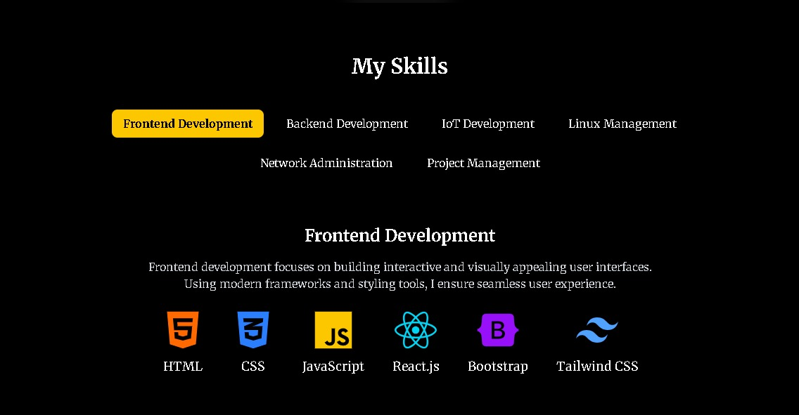
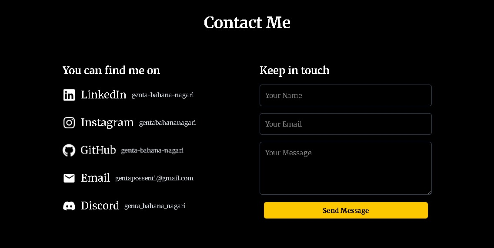

# Personal Portfolio


## 🚀 About the Project
This is my personal portfolio website built using **React, Vite, and Tailwind CSS**. It showcases my skills, projects, and experiences in an interactive and modern UI.

## 🛠️ Tech Stack
- **Frontend:** React, Vite, Tailwind CSS
- **Deployment:** Vercel / Netlify / GitHub Pages / Cloud VPS (with npm run build method for deployment)
- **Live Demo:** [My Portfolio](https://gentabahana.me/)

## ✨ Features
- Responsive design with Tailwind CSS
- Smooth animations and transitions
- Dynamic project showcase
- Contact form with email integration

## 📦 Installation & Setup
To run this project locally, follow these steps:

1. **Clone the repository:**
   ```sh
   git clone https://github.com/genta-bahana-nagari/portfolio-page-v2.git
   ## or you can do:
   git clone https://github.com/genta-bahana-nagari/portfolio-page-v2.git your_directory_name
   cd portfolio-page-v2 # or other directories
   ```
2. **Install dependencies:**
   ```sh
   npm install
   ```
3. **Run the development server:**
   ```sh
   npm run dev
   ```
4. Open [http://localhost:5173](http://localhost:5173) in your browser.

## 🚀 Deployment
To deploy the project, use one of these services:
- **Vercel:** `vercel --prod`
- **Netlify:** Connect your repo and deploy
- **GitHub Pages:** Use `gh-pages` package

## 📷 Screenshots




## 👤 Author
- **Your Name** – [LinkedIn](https://www.linkedin.com/in/genta-bahana-nagari/) | [GitHub](https://github.com/genta-bahana-nagari)

## 🌟 Show Your Support
If you like this project, feel free to give it a ⭐ on GitHub!

## 📜 License
This project is licensed under the **MIT License**.
