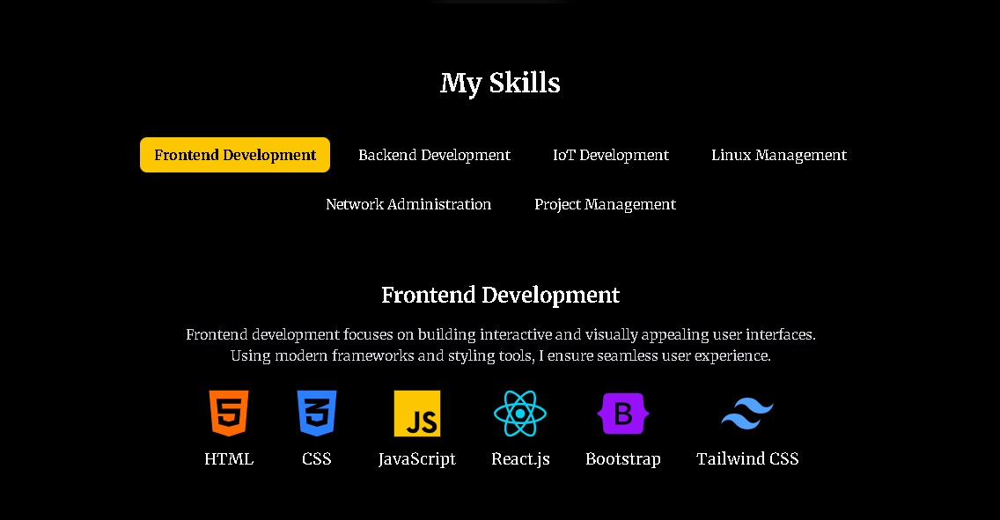
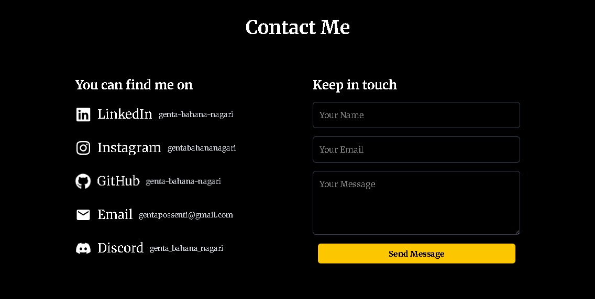

# ⚠️ Warning: This Project is No Longer Maintained

> **Note:** Code in this branch is no longer actively maintained. It may contain outdated dependencies or unsupported features. Use at your own risk. It's highly recommended to check and use the main branch.

---

# Personal Portfolio


## 🚀 About the Project

This is my personal portfolio website built using **React, Vite, and Tailwind CSS**. It showcases my skills, projects, and experiences in an interactive and modern UI.

---

## 🛠️ Tech Stack

- **Frontend:** React, Vite, Tailwind CSS
- **Deployment:** Vercel / Netlify / GitHub Pages / Cloud VPS (with npm run build method for deployment)

---

## ✨ Features

- Responsive design with Tailwind CSS
- Smooth animations and transitions
- Dynamic project showcase
- Contact form with email integration

---

## 📦 Installation & Setup

To run this project locally, follow these steps:

1. **Clone the repository:**

   ```sh
   git clone https://github.com/genta-bahana-nagari/portfolio-page.git
   cd portfolio-page
   ```

2. **Set environment:**

   ```sh
   cp .env.example .env
   ```
   You will see this configuration and adjust them with your keys and links:
   ```sh
   VITE_EMAILJS_SERVICE_ID=your_service_id
   VITE_EMAILJS_TEMPLATE_ID=your_template_id
   VITE_EMAILJS_USER_ID=your_user_id

   VITE_YOUR_CV_LINK=your_cv_link
   VITE_YOUR_PORTFOLIO_LINK=your_portfolio_link

   VITE_YOUR_GITHUB_LINK=your_github_link
   VITE_YOUR_LINKEDIN_LINK=your_linkedin_link
   VITE_YOUR_INSTAGRAM_LINK=your_instagram_link
   VITE_YOUR_DISCORD_ID=your_discord_id
     
   ```

3. **Install dependencies:**

   ```sh
   npm install
   ```

4. **Run the development server:**

   ```sh
   npm run dev
   ```

5. Open [http://localhost:5173](http://localhost:5173) in your browser.

---

## 🚀 Deployment

To deploy the project, use one of these services:

- **Vercel:** `vercel --prod`, or you can connect your repo and deploy
- **Netlify:** Connect your repo and deploy
- **GitHub Pages:** Use `gh-pages` package
- **Nginx or Apache2:** With your private server or some sort of.

### ⚠️ Notes

If you want to self host it with Nginx or Apache, it's recomended to build the project:

```sh
npm run buld
```

Then put the dist folder to your server.

---

## 📷 Screenshots

  
  


---

## 👤 Author

- **Genta Bahana Nagari** – [LinkedIn](https://www.linkedin.com/in/genta-bahana-nagari/) | [GitHub](https://github.com/genta-bahana-nagari)

---

## 🌟 Show Your Support

If you find this script helpful, feel free to ⭐ the repository and share it with others!

---

## 📜 License

This project is licensed under the **MIT License**. See the [LICENSE](LICENSE) file for details.

---
